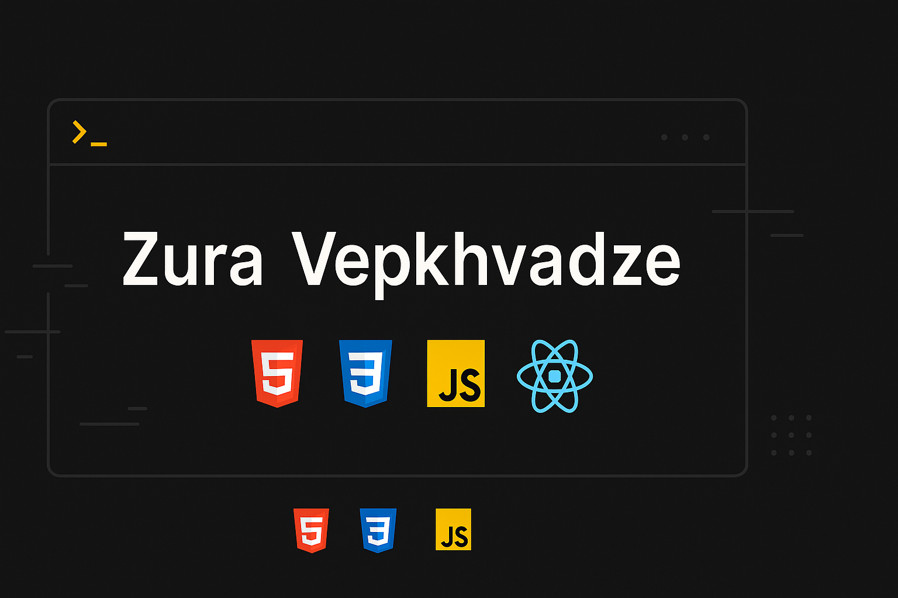

# Hi, I'm Zura 👋

I'm a frontend developer passionate about building responsive, user-friendly, and accessible web interfaces. I focus on writing clean HTML, CSS, and JavaScript — and I'm currently working through real-world challenges to sharpen my skills.I'm also working on small freelance-style front-end orders from design communities and local businesses — these help me apply frontend skills to real-world needs.

# 💻 Tech Stack:
  !   

---
## 🔭 I’m currently working on  
Building and refining real-world projects like the Frontend Mentor Contact Form and Interactive Card Details Form. I focus on clean, accessible code, fully responsive layouts, and UX details that elevate user experience.

## 👯 I’m looking to collaborate on  
Open-source or practice-based projects involving HTML, CSS, JavaScript, or React. I'm especially interested in designing and building reusable UI components, form validation systems.

## 🤝 I’m looking for help with  
Advanced JavaScript logic, animations with Framer Motion, accessibility testing, and learning industry-standard frontend workflows.

## 🌱 I’m currently learning  
Modern JavaScript (ES6+)
React.js and component-based architecture
Git/GitHub for version control & collaboration
Professional deployment with GitHub Pages and Vercel

## 💬 Ask me about  
Building responsive UIs, setting up GitHub repos and pages, structuring your first frontend project, or how to turn a static design into an interactive website.

## ⚡ Fun fact  
By night, I ride my motorcycle through mountains🌄. By day, I turn those experiences into clean, semantic code 🧠.
I’ve been working on self-driven and freelance-style frontend projects for a few years and continue growing as a junior frontend developer every day.

## 🌐 Socials:
   

### ✍️ Random Dev Quote

  ## 💰 You can help me by Donating
   

## 🌐 Find me here:

- 💻 [GitHub](https://github.com/notorious-code)
- 🎯 [Frontend Mentor](https://www.frontendmentor.io/profile/notorious-code)

Thanks for visiting my profile! 🙌
